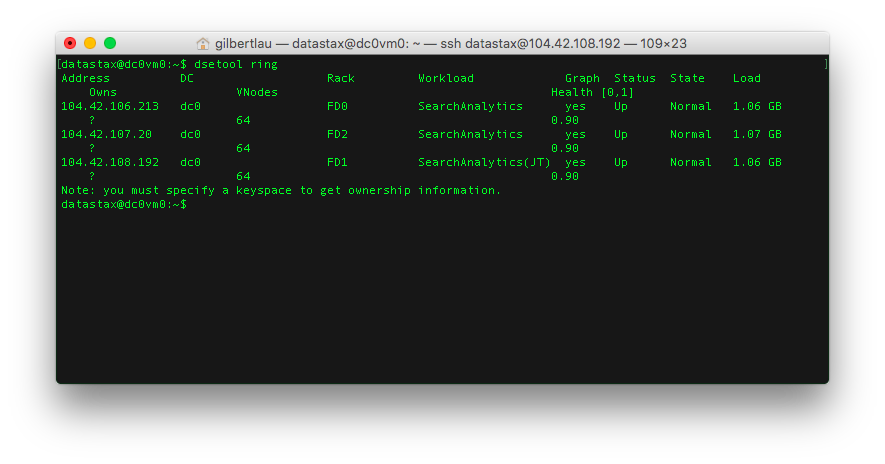
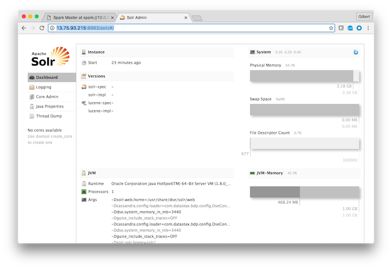

  **[Back to Agenda](./../../README.md)**

# Lab 1 - Accessing the Cluster

DSE Clusters with 3 nodes have been spawns for you today. Please ask trainers to provide you IP adresses for those environments. In this labs 
We will use  `YOUR_CLUSTER_IP` to design the IP adress of the seed of you cluster. This one will host tools like ops center and DataStax Studio.

#### A - Meet your cluster

Open a web browser to your OpsCenter node (*http://YOUR_CLUSTER_IP:8888*) to see the topology of your cluster.


Mouse over the nodes in your ring. There should be three, with the names node0, node1 and node2. Click on node0 to display details. You can browse the
differents tabs and screens to see what metrics and KPI are available within this tools.

For now we will connect to `node0`


#### B - Connect `node0` with SSH

We're now going to connect to a node using SSH and execute simple commands.

If you are on a Mac, you already have SSH installed in your terminal. If you are on Windows, you may need to install an SSH client. A popular SSH client is Putty. Putty can be downloaded from [http://www.putty.org](http://www.putty.org).

For this cluster, the username is `ds_user`.

You need to download [key files](https://1fichier.com/?7jtu78cezullbzu9r31r) to your local computer. *(The file is protected for obvious reasons, ask the trainer to get the password).*   
- For Linux/Mac user it is a `PEM file`   
- For Windows user it is `PPK file` 

```
On Linux/Mac
ssh -i /path/to/keyfile/rs.pem ds_user@<my_node_ip> 

On Windows
ssh -i /path/to/keyfile/rs.ppk ds_user@<my_node_ip> 
```

You may be prompted to accept the node's key. If so, type "yes" and hit enter.


#### First Commands

Once log with user ds_user please enter the following command anywhere :

```bash
dsetool ring
```



Each node should say the words "Search" and "Analytics" and the Graph's column has the value "yes". If any of them don't, you may have to SSH back into that node and ensure the new configuration is set.

Note that one of the nodes says "(JT)" This is your **Spark** job track. You can view a webpage with information about Spark jobs by opening a web browser to port 7080 on that node. For this cluster that is at http://your_sparkMaster_node_ip:7080. Note your URL will be different.


We also enabled **Solr** on our nodes. You can actually view the Solr UI on any node. However, for our exercises we're going to use node0.  Open a web browser to port 8983 /solr/ on node0. For this cluster that is at http://YOUR_CLUSTER_IP:8983/solr. The URL will be different for your cluster.



To see how the node behave you can also use nodetool with `status` command.

```bash
nodetool status
```

You've now logged into the administrative tool, OpsCenter, on your cluster. You've also used SSH to connect to each database node in your cluster. Finally you've logged into the administrative interfaces for both Spark and Solr. Next up we're going to start putting data in the database!

  **[Back to Agenda](./../../README.md)**
