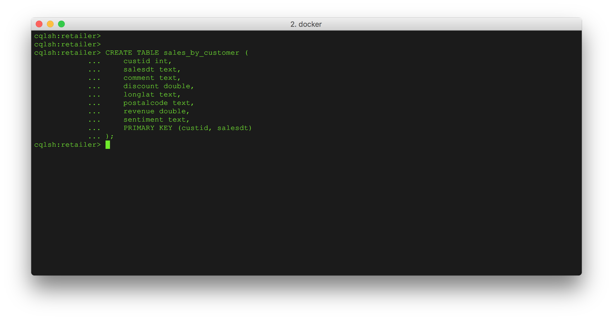

**[Back to Agenda](./../README.md)**

# Lab 2 - CQL

Use SSH to connect to one of your nodes.  We're now going to start the cqlsh client.

And before we go on, a quick explanation of what CQL, CQLSH and other aspects of Cassandra and DataStax Enterprise is in order:

The Cassandra Query Language (CQL) is the primary language for communicating with the Cassandra database. The most basic way to interact with Cassandra is using the CQL shell, cqlsh. Using cqlsh, you can create keyspaces and tables, insert and query tables, plus much more. If you prefer a graphical tool, you can use DataStax DevCenter. For production, DataStax supplies a number of drivers so that CQL statements can be passed from client to cluster and back.

To start the cqlsh client run the command:

```
# use the specific connected node name or `hostname -I`

cqlsh node0
```


Let's make our first Cassandra Keyspace! If you are using uppercase letters, use double quotes around the keyspace.

```sql
CREATE KEYSPACE if not exists YOUR_KEYSPACE
WITH REPLICATION = {'class' : 'SimpleStrategy', 'replication_factor' : 3};
```


And just like that, any data within any table you create under your keyspace will automatically be replicated 3 times. Let's keep going and create ourselves a table. You can follow my example or be a rebel and roll your own.

```sql

use YOUR_KEYSPACE;

CREATE TABLE if not exists transactions (
    account_number text,
    transaction_time timestamp,
    amount double,
    items map<text, double>,
    location text,
    merchant text,
    notes text,
    status text,
    tags set<text>,
    transaction_id text,
    user_id text,
    PRIMARY KEY (account_number, transaction_time)
) WITH CLUSTERING ORDER BY (transaction_time DESC);
```



This table is very simple but don't worry, we'll play with some more interesting tables in just a minute.

Let's get some data into your table! Cut and paste these inserts into DevCenter or CQLSH. Feel free to insert your own data values, as well.

```sql
INSERT INTO transactions (account_number,transaction_time,amount,merchant, notes, status) VALUES ('1', '2018-01-11', 299.0, 'Target', 'Shopping', 'SUCCESS');
INSERT INTO transactions (account_number,transaction_time,amount,merchant, notes, status) VALUES ('2', '2018-01-12', 1999.0, 'Wal-Mart', 'Houshold', 'CANCELLED');
INSERT INTO transactions (account_number,transaction_time,amount,merchant, notes, status) VALUES ('1', '2018-01-13',  1499.00, 'Amazon','Shopping', 'SUCCESS');
INSERT INTO transactions (account_number,transaction_time,amount,merchant, notes, status) VALUES ('1', '2018-01-04', 399.0, 'Amazon','Shopping', 'CANCELLED');
INSERT INTO transactions (account_number,transaction_time,amount,merchant, notes, status) VALUES ('2', '2018-01-15', 560.0, 'Macys', 'Shopping', 'SUCCESS');
```

Now, to retrieve data from the database run:

```sql
select * 
from transactions 
WHERE account_number='1' 
AND transaction_time >='2018-01-01';
```

Compute Sum :

```sql
select sum(amount) 
from transactions 
where account_number = '1' 
and transaction_time >= '2017-09-01' 
and transaction_time < '2018-02-01';
```


See what I did there? You can do range scans on clustering keys! Give it a try.

Hey you can also use standard aggregate functions.

```sql
select account_number, sum(amount) 
from transactions group by account_number;
```

If you have time checkout the Upsert, the TTL and LWT.

#### QUESTIONS 

````
1. What happens if you insert the same rows multiple times ?  In the table, On the disk ?

2. Insert a new partition with the TTL of 10 seconds.

3. Insert a duplicate row of the available partitions with IF NOT EXISTS statement. What can you see?

4. What happens when you insert a NULL value?
````


**[Back to Agenda](./../../README.md)**
